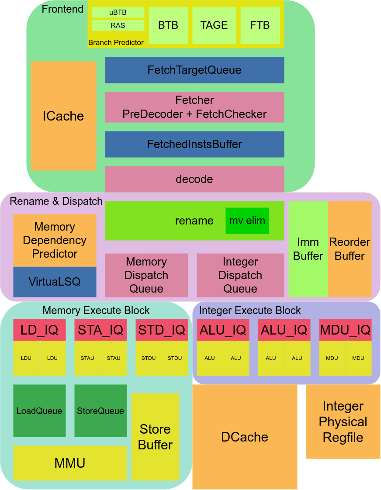

# aura-core

## Architecture




## develop-env
- vscode
  - [Verilog-HDL/SystemVerilog](https://github.com/mshr-h/vscode-verilog-hdl-support)
- ctags
- [Verible](https://github.com/chipsalliance/verible)
- verilator == 5.012 (very important!!)
- [yosys](https://github.com/YosysHQ/yosys) (with plugin [antmicro/yosys-systemverilog](https://github.com/antmicro/yosys-systemverilog))

## doc and architecture
plz see *.drawio.png in ./doc


## emulation with verilator

aura support a serial of simple options
```
# compile
export AURA_HOME=`pwd`
make aura # if enable wave trace: make aura USE_TRACE=1

# for help
./build/aura -h

# simple test
./build/aura -f ready-to-run/simpletest0.bin 
# if enable difftest
./build/aura -f ready-to-run/simpletest0.bin -d diff-ref-so/riscv64-spike-so
# fully argument
./build/aura -f ready-to-run/simpletest0.bin -d diff-ref-so/riscv64-spike-so --debug-flags COMMIT -e t2000

# enable debug flags
./build/aura -f ready-to-run/simpletest0.bin -d diff-ref-so/riscv64-spike-so --debug-flags FETCH,DECODE,COMMIT
# all debug flags can be find at sim/verilator/inc/flags.hpp
```

## statistics

aura will dump some message when run completed

all statistical keywords can be found at stats.txt

## difftest support

now aura use spike to difftest
```
git clone https://github.com/tastynoob/riscv-isa-sim.git

cd riscv-isa-sim && git checkout aura-difftest

cd difftest && make CPU=AURA

cp build/riscv64-spike-so $AURA_HOME/diff-ref-so
```

## compile for aura firmware

go to ./firmware  
install vscode plugin EIDE  
open firmware.code-workspace  


# thanks for any help!